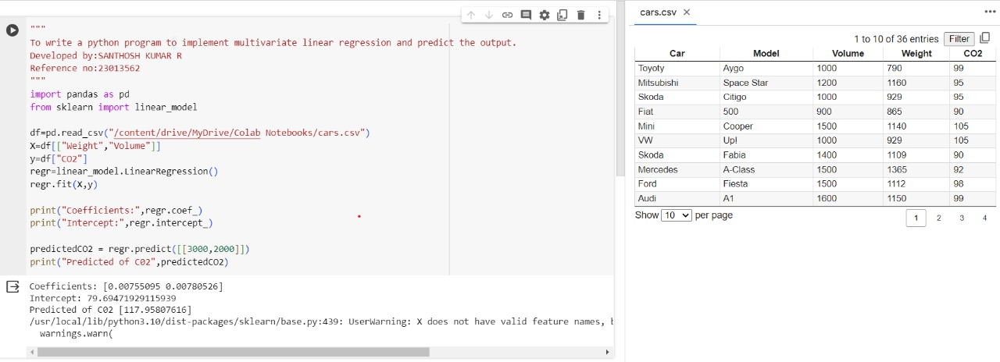

# Implementation of Multivariate Linear Regression
## Aim
To write a python program to implement multivariate linear regression and predict the output.
## Equipment’s required:
1.	Hardware – PCs
2.	Anaconda – Python 3.7 Installation / Moodle-Code Runner
## Algorithm:
### Step1
Importing pandas and scilkit-learn libraries

### Step2
Reading the data from a csv file

### Step3
spiliting the data into feature(X) and target(Y).

### Step4
creating and fitting the linear regression model

### Step5
printing the coefficents and intercept of the linear regression model.

### step6
making a prediction.

### step7
printing the predicted CO2 emissions.

## Program:
```
"""
To write a python program to implement multivariate linear regression and predict the output.
Developed by: SANTHOSH KUMAR R
Reference no: 23013562
"""
import pandas as pd
from sklearn import linear_model

df=pd.read_csv("/content/drive/MyDrive/Colab Notebooks/cars.csv")
X=df[["Weight","Volume"]]
y=df["CO2"]
regr=linear_model.LinearRegression()
regr.fit(X,y)

print("Coefficients:",regr.coef_)
print("Intercept:",regr.intercept_)

predictedCO2 = regr.predict([[3000,2000]])
print("Predicted of C02",predictedCO2)

```
## Output:



## Result
Thus the multivariate linear regression is implemented and predicted the output using python program.